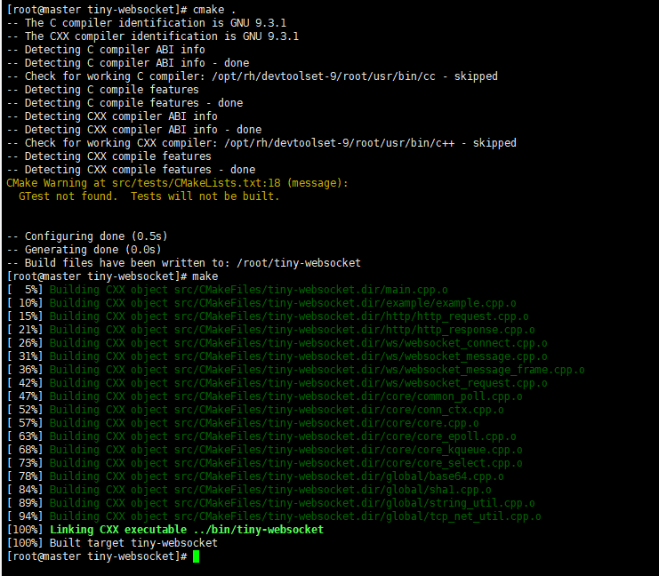
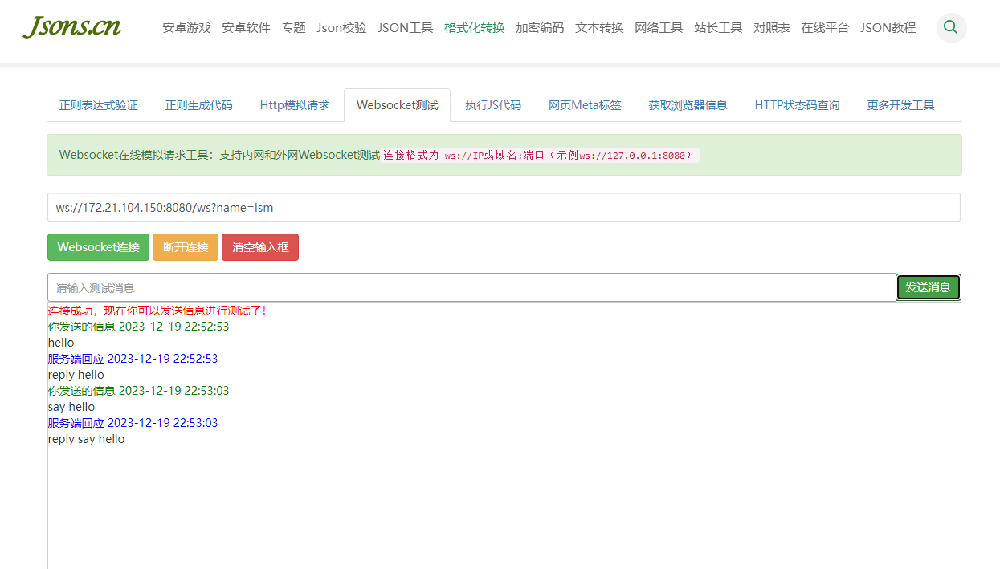
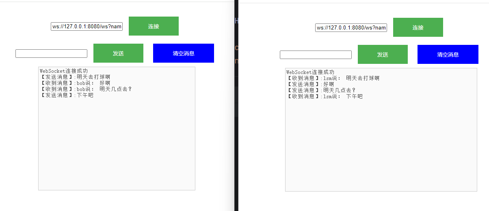

# tiny-websocket

Simple websocket server written in C++

使用C++编写的非阻塞websocket服务器

### 环境说明

- 操作系统：linux或MacOS（windows暂不支持）
- C++标准17

### 编译说明

#### 使用CMake（推荐）

````shell
git clone https://github.com/lsm1998/tiny-websocket.git
cd tiny-websocket
cmake .
make
````


### 运行效果

#### 在线网站测试 reply消息

网址：http://www.jsons.cn/websocket/



#### 使用example目录的html文件测试群聊




